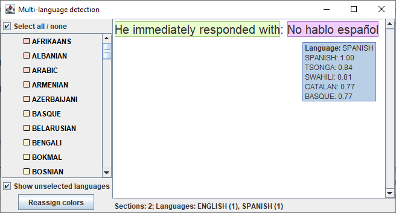

# Tiny Lingua

Tiny Lingua is a fork of the [Lingua](https://github.com/pemistahl/lingua) project with the intention
to increase detection speed and reduce memory consumption. See the [Performance Optimizations documentation](./Performance%20Optimizations.md)
for a detailed description of considered and implemented performance optimizations of this project.
Some of the changes have already backported to the original Lingua project.

Tiny Lingua is fully implemented using Java byte code, no native libraries are used. It can be used
by any JVM language, but is mainly designed for Java and Kotlin.

In general you should notice the following improvements when using this library:
- **Faster memory model load times**\
  This is especially noticeable when configuring Tiny Lingua to preload the models for all languages.
- **Reduced memory usage for language models**\
  With all language models loaded the original Lingua library requires > 1.2 GB of memory at runtime
  whereas this library requires ~150 MB. (Though in most use cases detection of all supported languages
  is not necessary and a subset of these languages suffices.)
- **Reduced memory consumption during language detection**\
  The original Lingua library can require multiple MBs of temporary memory during language detection,
  whereas this library only requires a fraction of that.
- **Better parallelization**\
  For multi-core processors this library distributes the work more evenly across the cores to increase
  language detection speed.

One main goal of this project is to provide the same language detection accuracy as the original Lingua
project; in fact its model files are based on the model files of the original Lingua project in the
corresponding version. Additionally, the API should be as close as the possible to the original API.
The package names are the same, so this library can be easily used as replacement.
However, there are some differences:
- The package `com.github.pemistahl.lingua.api.io` has been removed\
  Most likely this does not affect many users because you would normally not create your own language
  models, but rely on the models provided by Lingua itself.
- The format of the binary models stored in the JAR file is an implementation detail\
  The format may change at any point and users of this library should not make any assumptions about it.

The detection confidence values returned by this library won't be exactly the same as the ones
returned by the original Lingua library. However, the differences should be negligible.

The versioning scheme is `<version>-L<upstream-lingua-commit>`. For example `1.0.0-L44ee38c1` means:
- Tiny Lingua version 1.0.0
- based on upstream Lingua commit `44ee38c1`, see [GitHub commit search](https://github.com/search?q=repo%3Apemistahl%2Flingua+44ee38c1ba79698e704f217162f625bd87632d6a&type=commits)

Note that the upstream Lingua commit does not guarantee that all of the APIs and functionality of that version
are supported. Some features might be omitted (or replaced) in this library.

> [!WARNING]\
> The performance optimizations done in this project come at a price:
> - The code is not well tested. However, at least the regular accuracy report is generated and it is
>   compared against the previous report to detect any regression regarding detection accuracy.
> - The code may not be easily maintainable and integrating future upstream Lingua changes might be
>   difficult.
> 
> However, any feedback is greatly appreciated!

## Usage

Requirements:
- JDK 11 or newer

> [!NOTE]\
> Tiny Lingua is not published to Maven Central yet, you either need to [build it yourself](#building) and
> then for example run [`./gradlew publishToMavenLocal`](https://docs.gradle.org/8.10.1/userguide/publishing_maven.html#publishing_maven:install)
> to install it to your local Maven repository, or use a service like [JitPack](https://jitpack.io/#Marcono1234/tiny-lingua)[^1].

### Detect single language

To detect a single language, use `LanguageDetector#detectLanguageOf`; it returns `Language.UNKNOWN` if the language could not be detected.\
To prevent incorrect results if multiple languages have similar detected probability, use `LanguageDetectorBuilder#withMinimumRelativeDistance`.

```kotlin
val languageDetector = LanguageDetectorBuilder.fromLanguages(
    Language.ENGLISH, Language.SPANISH, Language.FRENCH
).build()
val language = languageDetector.detectLanguageOf("Lingua, what language is this?")
println(language)  // ENGLISH
```

### Determine language detection confidence

To get the confidence values of all detected languages, use `LanguageDetector#computeLanguageConfidenceValues`.
You can then compare the confidence values and determine how accurate the detection was, or if there
are languages which are very unlikely.

The confidence values are relative to the language with the highest confidence (1.0); they are not absolute numbers.

```kotlin
val languageDetector = LanguageDetectorBuilder.fromLanguages(
    Language.ENGLISH, Language.SPANISH, Language.FRENCH
).build()
val confidenceValues = languageDetector.computeLanguageConfidenceValues("Lingua, what language is this?")
println(confidenceValues)  // {ENGLISH=>1.0, FRENCH=>0.8, SPANISH=>0.7}
```

### Detect multiple languages

> [!NOTE]\
> Detection of multiple languages is currently experimental. Feedback is appreciated, either as GitHub [issue](https://github.com/Marcono1234/tiny-lingua/issues)
> or [discussion](https://github.com/Marcono1234/tiny-lingua/discussions).
 
If input text is written in multiple languages, the other Lingua detection methods will likely give incorrect
results. Instead, the method `LanguageDetector#detectMultiLanguageOf` can be used. It returns separate sections
for text detected to be written in different languages. Depending on the use case you will likely have to
post-process these sections, for example ignore short sections since their accuracy might be low.

Detection currently uses certain punctuation as hint where switches between languages might occur.

```kotlin
val languageDetector = LanguageDetectorBuilder.fromLanguages(
    Language.ENGLISH, Language.SPANISH, Language.FRENCH
).build()
val sections = languageDetector.detectMultiLanguageOf("He immediately responded with: No hablo español")
println(sections)  // [("He immediately responded with", ENGLISH, ...), ("No hablo español", SPANISH, ...)]
```

For demonstration purposes there is also a GUI you can try for multi-language detection:
```sh
java -jar build/libs/tiny-lingua-*-with-dependencies.jar
```
(this `...-with-dependencies.jar` is part of the release artifacts, or can be built manually using `./gradlew shadowJar`)



## Performance tips

- If you expect input text to be written only in certain languages, only specify those languages instead of `Language.all()`\
  However, if the text unexpectedly is written in a language which has not been specified, the results will be less accurate.
- Use `LanguageDetectorBuilder#withPreloadedLanguageModels()` to load all language models at the start, otherwise later
  small performance decreases could occur when models have be loaded on demand
- If the input text is rather long, you can use `LanguageDetectorBuilder#withLowAccuracyMode()`
- Use `LanguageDetectorBuilder#withExecutor(...)` to customize how concurrent processing is performed\
  Alternatively you can use `withExecutor { it.run() }` to run single-threaded in the calling thread.
- For increased detection speed at the cost of higher memory usage, use `LanguageDetectorBuilder#withIncreasedDetectionSpeed()`

## Building

The Git history of this project, including the history of the upstream Lingua project, has become quite
large. It is therefore recommended to perform a shallow Git clone:

- Only recent changes:
    ```sh
    git clone --depth=5 https://github.com/Marcono1234/tiny-lingua.git
    ```
- Changes since the first performance optimizations:
    ```sh
    git clone --shallow-since="2022-06-09T00:00:00Z" https://github.com/Marcono1234/tiny-lingua.git
    ```

Gradle is used for building this project:
```sh
./gradlew build
```

The first build may take a while and consume a lot of memory because it is transforming the original
Lingua language models to the binary format used by Tiny Lingua. However, subsequent builds will
use the cached build outputs and should therefore be a lot faster.

### IntelliJ build issues

IntelliJ IDEA currently has problems setting up the project when importing it from Gradle: The test
code under `src/test/kotlin` is unable to find the classes from the main code.\
(this only affects IntelliJ; `./gradlew` is not affected)

A temporary workaround for this is:
1. Right-click the top-level project folder in the "Project" tab and select "Open Module Settings"
2. Remove the "buildSrc.main" module 
3. Select the "main" module
   1. Select the "Sources" tab
   2. On the right remove all "Content Root" entries
4. Safe and close the module settings
5. Open the module settings again 
6. Select the "main" module
   1. Select the "Sources" tab
   2. Click "Add Content Root"
   3. Select `lingua/src/main`
   4. Mark both `java` and `kotlin` as "Sources"
7. Safe and close the module settings

However, when IntelliJ reloads the project from the Gradle build files this configuration change
has to be done again.

The reason for this might be the non-standard way `buildSrc/build.gradle.kts` includes source files from
the main source code.

[^1]: Make sure that Maven Central is declared before JitPack, to make sure all other artifacts are downloaded
from Maven Central. Additionally, for Gradle you can use [repository content filtering](https://docs.gradle.org/8.10.1/userguide/declaring_repositories_adv.html#declaring_content_exclusively_found_in_one_repository)
to specify that JitPack is only used for Tiny Lingua.
